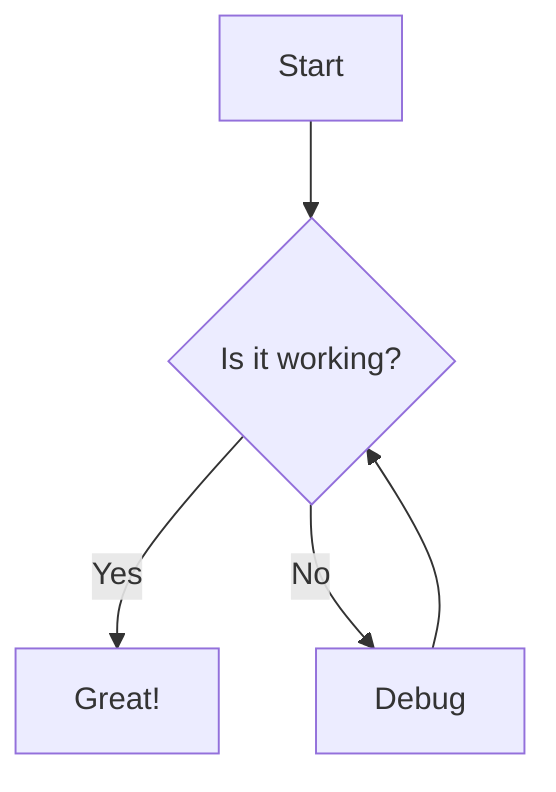

# Mermaid Cheat Sheet

Mermaid (aka mermaid.js) creates diagrams super easily in your web apps and in Markdown.

## Getting Started in Astro
Mermaid needs to render server-side using rehype-meraid, Playwright, and MermaidJS itself. 
```bash
npm install @astrojs/mdx
npm install playwright
npx playwright install --with-deps chromium
npm install rehype-mermaid
npm install mermaid
```

---
Pro tip! You probably want to disable the default syntax highlighting in VS Code. Do this in astro.config.mjs:
```javascript
import { defineConfig } from 'astro/config';
import rehypeMermaid from 'rehype-mermaid';

export default defineConfig({
  markdown: {
    syntaxHighlight: {
      type: 'shiki',
      excludeLangs: ['mermaid', 'math'],
    },
    rehypePlugins: [rehypeMermaid],
  },
});
```
---


## Simple diagram



